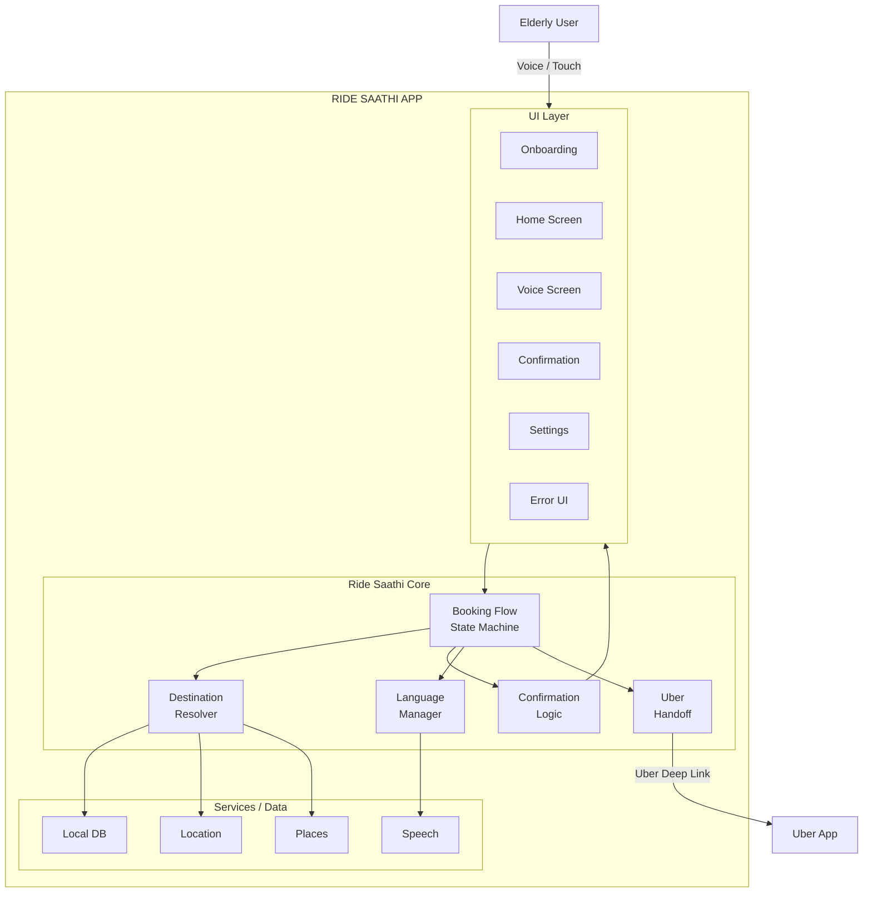
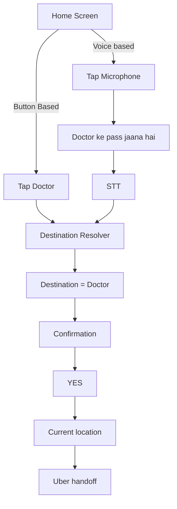
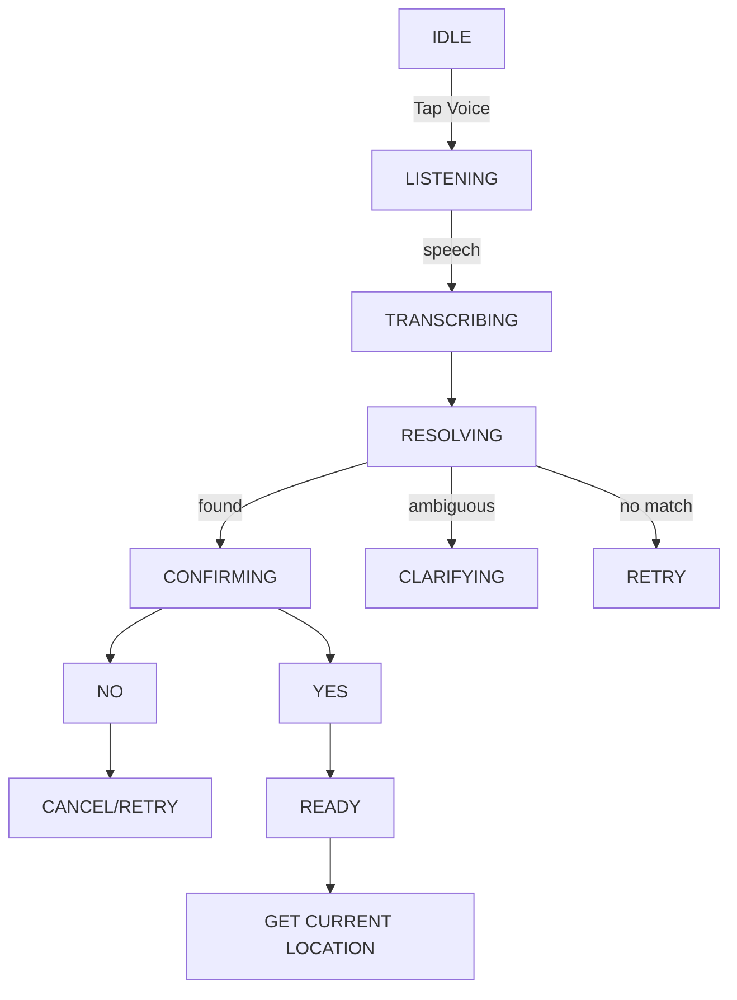

## Requirements

- Easy to book an Uber ride via voice conversations for the elderly people who are not that technically skilled to book an Uber ride from their mobile devices.
- Have a list of saved places inside the app done during the initial onboarding process of the app.
- The onboarding process can be initially setup by a family member once.
- User needs to enter the Home address and it is mandatory for all users to enter their home address.
- Multi-lingual Support (English/Hindi for now; Telugu translations archived for later)
- The entire app should work with the same language once the user has chosen it, even while onboarding.
- Extremely easy to use and friction less to use.
- Confirm the location to the user first before continuing to the cab-service app.
- In terms of booking, we are not exactly handling the booking of a cab or bike because the can booking apps do not provide their API's to book in behalf of them.
- Uber has the option of deeplinks (<https://developer.uber.com/docs/riders/ride-requests/tutorials/deep-links/introduction>) where we can create links with geo-location of pickup and dropoff which will help the Uber app to open the application with prefilled details about the location, then the user has to just choose the necessary ride he/she needs.
- Currently we will only develop this app for Uber in mind.

### Current Roadmap

- V0 will be completed when we do complete the necessary requirements up and then we will go further.
- We will test it out with few elderly people when, we have a proper voice-based approach and get their feedback.
- We launch online to my others when at least 3-5 elderly people can easily operate the app.
- **Note**: This is a side project, so we are just trying to solve a simple problem of making the elderly people around me to not annoy me anymore to book their rapido or uber and they themselves can manage it.

## Current Scope

### Ride Saathi V0 does

- Stores user profile
- Stores Home
- Stores saved destinations
- Lets user tap destination
- Lets user speak destination
- Understands Multi-lingual (English/Hindi)
- Confirms destination
- Gets current pickup location
- Generates Uber handoff
- Opens Uber

### Ride Saathi V0 does NOT do

- Book an Uber itself
- Select Uber Cab/Auto/Bike
- Handle payment
- Show driver information
- Track the ride
- Cancel Uber rides
- Estimate fares
- Estimate arrival time
- Handle arbitrary destinations by voice
- Replace Uber

## System Architecture



## User Flows

### Onboarding Flow


### Booking Flow



## Data Models

### User

| Property             | Purpose               |
| -------------------- | --------------------- |
| Name                 | Personalized Prompts  |
| Language             | en, hi, te            |
| Onboarding Completed | Prevent partial setup |

### Saved Place

| Property          | Purpose                          |
| ----------------- | -------------------------------- |
| ID                | Internal Identity                |
| Friendly Name     | "Home", "Doctor", "Ramesh House" |
| Formatted address | Confirmation + Uber              |
| Latitude          | Navigation                       |
| Longitude         | Navigation                       |
| Is Home           | Special mandatory destination    |

## State Machines

### Voice



## Edge Cases

| Situation                                         | Ride Saathi should do                                                                                                                                                                                                                         |
| ------------------------------------------------- | --------------------------------------------------------------------------------------------------------------------------------------------------------------------------------------------------------------------------------------------- |
| Microphone permission denied                      | Explain simply + offer button flow                                                                                                                                                                                                            |
| Location permission denied                        | Explain why pickup location is needed                                                                                                                                                                                                         |
| GPS disabled                                      | Enable location from the app                                                                                                                                                                                                                  |
| Current location unavailable                      | Don't silently guess, ask the user to try opening their location permission                                                                                                                                                                   |
| Current location stale                            | Request/update location                                                                                                                                                                                                                       |
| Internet unavailable                              | Show simple retry + saved places remain available                                                                                                                                                                                             |
| Speech cannot be understood                       | Ask once again                                                                                                                                                                                                                                |
| Speech repeatedly fails                           | Fall back to large saved-place buttons                                                                                                                                                                                                        |
| No destination matches                            | Tell user and show saved destinations                                                                                                                                                                                                         |
| Two destinations match                            | Ask which one                                                                                                                                                                                                                                 |
| User says "no"                                    | Return to destination selection                                                                                                                                                                                                               |
| User changes mind                                 | Cancel flow                                                                                                                                                                                                                                   |
| User says "cancel"                                | Immediately stop voice flow                                                                                                                                                                                                                   |
| Uber not installed                                | Confirm before completing onboarding and also check before handing opening Uber and if not there <br>Tell the User to Download it by going to the playstore or provide them a button to open the play store directly so that they can install |
| Uber cannot handle destination                    | Keep user inside Uber and don't pretend booking succeeded                                                                                                                                                                                     |
| Place removed/renamed                             | Update saved destination                                                                                                                                                                                                                      |
| Home accidentally deleted                         | Require replacement before deletion                                                                                                                                                                                                           |
| Two saved places have same name                   | Prevent them while creation or updation itself by suggesting there is already a place with this name.                                                                                                                                         |
| STT detects wrong language                        | Stay with selected language unless user intentionally changes settings                                                                                                                                                                        |
| Voice starts while audio is playing               | Stop prompt before listening                                                                                                                                                                                                                  |
| User waits too long                               | Repeat once rather than remaining stuck                                                                                                                                                                                                       |
| Phone call interrupts app                         | Safely cancel/pause voice session                                                                                                                                                                                                             |
| App is killed midway                              | Never resume directly into Uber                                                                                                                                                                                                               |
| User double taps destination                      | Prevent duplicate navigation actions                                                                                                                                                                                                          |
| User taps YES repeatedly                          | Uber should only launch once                                                                                                                                                                                                                  |
| Device lacks Uber                                 | Web/store fallback and tell them to install it                                                                                                                                                                                                |
| Destination coordinates exist but address missing | Repair destination before handoff                                                                                                                                                                                                             |
| User says something unrelated                     | Explain available destinations                                                                                                                                                                                                                |
| User says a destination not saved                 | V0 says it isn't saved rather than guessing                                                                                                                                                                                                   |

# V0 development roadmap

1. **Freeze the product contract.**
2. **Build onboarding without voice.**
3. **Build button-only booking.**
4. **Build the booking state machine.**
5. **Build Uber handoff resilience.**
6. **Add speech-to-text as an input method only.**
7. **Build destination resolution.**
8. **Add conversational confirmation.**
9. **Build failure recovery.**
10. **Do accessibility polish only after the complete flow works.**
11. **Test internally with adversarial scenarios.**
12. **Then put it in front of the 3–5 elderly users you mentioned.**

## Android implementation

The V0 Android app is in `app/`. It uses Kotlin, Jetpack Compose, on-device preferences for the profile and saved places, Ola Maps address search and an OpenStreetMap map preview for family setup, Android speech recognition and text-to-speech, and a native Uber ride-request link. Android's share sheet can send a WhatsApp or Google Maps location link to Ride Saathi; the app shows the shared destination for confirmation before opening Uber. It does not book or pay for a ride.

### Run it

1. Install Android Studio with JDK 21 and Android SDK 36. Open this directory as a Gradle project.
2. Build with `./gradlew assembleDebug` and install `app/build/outputs/apk/debug/app-debug.apk` on a physical Android phone with Google Play services, a speech recognition service, and Uber. Configure an Ola Maps API key as described below before searching for addresses. The app needs internet for address search and map preview, location permission for pickup, and microphone permission for voice input.
3. Complete onboarding, search for and select Home, save it, add any other destinations, and verify the Uber handoff. On Android, Uber may show the destination after the rider taps **Set Pickup Location**.

### Shared Google Maps locations

Share a place from Google Maps to Ride Saathi after completing setup. Coordinate links open destination confirmation directly. Short links (`maps.app.goo.gl` and `goo.gl/maps`) are expanded in the background over HTTPS with bounded redirects and timeouts. If a link only contains a place name/address, Ride Saathi searches that name using the configured Ola Maps provider, shows the original address alongside candidate destinations, and asks the rider to select the correct result before confirmation. Search results may differ from Google's pin; check the address and map. No destination is saved and Uber is not opened automatically.

Short links need internet; address-only links also need the Ola key. Loading can be cancelled, and older responses cannot replace a newer share or saved-place selection. Network errors and links with no resolvable destination have separate messages. Live-location tracking and place-ID-only links without a readable address are not supported.

### Ola Maps address search

Create credentials in the [Ola Maps developer portal](https://maps.olakrutrim.com/docs/auth), then add this to the ignored `local.properties` file (keep the existing `sdk.dir`):

```properties
OLA_MAPS_API_KEY=your_api_key
```

Alternatively supply the `OLA_MAPS_API_KEY` environment variable when building; it takes precedence. Rebuild and reinstall after setting or changing the key. Do not commit credentials. Builds without a key still work with existing saved places; new searches explain that setup is needed.

Search uses Ola's [Autocomplete API](https://maps.olakrutrim.com/docs/places-apis/autocomplete-api), whose response includes address descriptions and coordinates. It makes one request after a 500 ms typing pause (minimum three characters), without extra Place Details requests or automatic retries. English/Hindi requests use Ola's language codes. Once Home is saved, its coordinates bias searches toward nearby results without restricting searches to that area. The first Home search has no location bias: include the city/locality in the query. Only results with valid coordinates can be selected. Missing credentials, rejected credentials, quota exhaustion, and service errors have separate messages. Existing saved places and custom map-preview endpoints are preserved; legacy Nominatim search endpoints are no longer used.

The [current Ola rate card](https://maps.olakrutrim.com/pricing/details) includes 100,000 calls per API per month, effective 1 September 2026. Verify the allowance in your account and keep paid top-ups disabled for a free-only pilot. Usage is shared across all installations using a key. A key embedded in an Android APK is extractable: this direct integration is for the small pilot; use a backend with account-wide quotas and abuse controls before broad distribution. Do not embed OAuth client secrets in the app.

Place setup and ride confirmation continue to use the bundled Leaflet 1.9.4 viewer with OpenStreetMap raster tiles, a destination pin, and attribution. Search attribution identifies Ola Maps separately. Places can be saved without waiting for map tiles. Map failures and a 20-second loading timeout offer a retry. The [OSM tile policy](https://operations.osmfoundation.org/policies/tiles/) still applies to previews.

Before relying on the new provider, compare 10–20 previously failing apartment, hospital, landmark, and full-address searches on the target phone; check the first five results and the selected pin. API contract tests use fake responses and do not establish real-world coverage or accuracy.


Map loading regression checks: `node --test app/src/test/js/map-preview.test.cjs`. Android checks: `./gradlew :app:testDebugUnitTest :app:assembleDebug :app:assembleRelease :app:lintDebug`. Device UI checks: `./gradlew :app:connectedQaAndroidTest` (uses a separate `.qa` app and requires an unlocked phone that allows test installations). Leaflet's license is included in `app/src/main/assets/map/LICENSE`.

Saved places remain on the device. Clearing app data removes them. The prototype has no family account, cloud sync, fare information, ride type selection, or ride status. Before the elderly-user pilot, validate English and Hindi speech and spoken output, screen reader behavior, map search, and the final Uber screen on the actual target phones. Telugu is temporarily unavailable; existing Telugu profiles switch to English, and translations are retained in `Words.kt` for future support.


### Pilot voice matching and test guide

Saved names work across supported Hindi/Roman spellings, with common bilingual place words. Place setup asks for one name; aliases saved by earlier versions are retained for voice matching. Overlapping names now prefer the complete, more specific phrase: with `ghar` and `beta ka ghar` saved, `बेटे के घर जाना है` selects `beta ka ghar`, while `घर जाना है` selects Home. Mentioning two separate destinations still asks the user to choose. Every match goes through destination confirmation before Uber opens.

Place setup starts with a dedicated address picker: the search field stays above a scrollable result list, with no name fields or map taking up result space. Selecting an address opens a short form with one place name, a Change address action, an automatically displayed map preview, and a fixed Save button. Back from changing an address keeps the previously selected address. Address search runs automatically after a 500 ms pause once at least three characters are entered. The address field shows pending and loading states; its small search icon can search immediately or retry. Changing the query or leaving the editor cancels pending searches and ignores stale results. Confirmation actions appear before the map; cancellation remains available during location lookup. Permission-denial messages include an app-settings link. Deleting a saved place requires confirmation, and Home cannot be deleted.

See [the pilot test guide](docs/PILOT_TESTING.md) for checks to run with a family member before the first elderly-user sessions.
