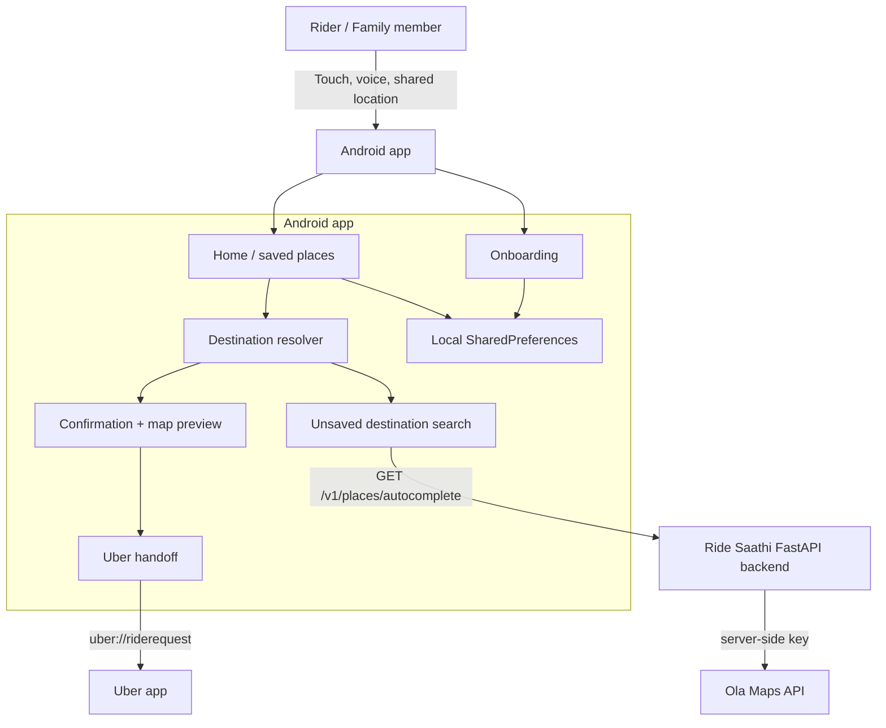

# Ride Saathi

Ride Saathi is an Android app for helping older family members start an Uber ride with as little friction as possible. It keeps the rider inside a simple voice-and-touch flow, confirms the destination, gets the current pickup location, and then hands off to Uber with pickup/drop-off details prefilled.

The app does not book the ride itself. Uber still owns ride selection, pricing, payment, confirmation, tracking, and cancellation.

## Current State

Ride Saathi currently includes:

- Jetpack Compose Android app in `app/`
- One-time onboarding with language, rider name, mandatory Home, and optional saved destinations
- Local profile and saved-place persistence through Android `SharedPreferences`
- English, Hindi, and Telugu UI text support
- Large touch targets for saved destinations
- Speech input and text-to-speech prompts for destination selection and confirmation
- Saved-place destination matching with aliases, bilingual matching, ambiguity handling, and conservative substring rejection
- Unsaved destination search through a backend-backed place autocomplete flow
- Address confirmation with map preview
- Shared text/location handling from other apps for supported map links and addresses
- Current-location lookup before Uber handoff
- Uber deep-link handoff using `uber://riderequest`
- Debug/QA network security config for local backend testing
- JVM, JavaScript, backend, and Android instrumentation test coverage for the core flows

The project also includes a small FastAPI backend in `backend/`. The Android app calls this backend for place autocomplete so the Ola Maps API key never ships inside the APK.

## What It Does Not Do

Ride Saathi intentionally does not:

- Book, cancel, or track Uber rides
- Choose Uber cab/auto/bike options
- Handle fares, ETAs, driver details, payment, or ride history
- Replace Uber's final confirmation screen
- Store server-side user accounts
- Guarantee live speech accuracy without pilot testing on the target phones and speakers

## Architecture



## Repository Layout

| Path | Purpose |
| --- | --- |
| `app/` | Android app, Compose UI, domain logic, map assets, JVM and instrumentation tests |
| `backend/` | FastAPI place-search proxy for Ola Maps |
| `docs/PILOT_TESTING.md` | Manual pilot checklist for family/elderly-user testing |
| `docs/VALIDATION.md` | Latest validation notes and known test gaps |

## Android Setup

Requirements:

- JDK 17
- Android SDK with API 36 compile SDK available
- Android device or emulator for connected tests
- Uber installed on the test phone for real handoff checks

Build the app:

```sh
./gradlew :app:assembleDebug
```

Run JVM tests:

```sh
./gradlew :app:testDebugUnitTest
```

Run the map preview JavaScript regression test:

```sh
node --test app/src/test/js/map-preview.test.cjs
```

Run connected QA instrumentation tests:

```sh
./gradlew :app:connectedQaAndroidTest
```

The `qa` build type uses the separate package `com.ridesaathi.app.qa`, so device tests do not overwrite normal app data in `com.ridesaathi.app`.

## Backend Setup

The backend is required for live place autocomplete. See `backend/README.md` for the full API contract and deployment notes.

Local development:

```sh
cd backend
python -m venv .venv
source .venv/bin/activate
pip install -r requirements-dev.txt
cp .env.example .env
```

Set `OLA_MAPS_API_KEY` in `backend/.env`, then run:

```sh
uvicorn app.main:app --reload --env-file .env
```

The default local API URL is `http://localhost:8000`. Android emulators reach the host machine at `http://10.0.2.2:8000`, which is the debug/QA fallback in `app/build.gradle.kts`.

Run backend tests:

```sh
cd backend
source .venv/bin/activate
pytest -q
```

## API Base URL Configuration

`API_BASE_URL` is not secret; it is the public URL of the Ride Saathi backend. The Ola Maps key stays server-side in `backend/.env` or deployment secrets.

The Android build resolves `API_BASE_URL` in this order:

1. `API_BASE_URL` environment variable
2. `API_BASE_URL` in root `local.properties`
3. Build-type fallback

Current fallbacks:

| Build type | Fallback |
| --- | --- |
| `debug` | `http://10.0.2.2:8000` |
| `qa` | `http://10.0.2.2:8000` |
| `release` | blank/unconfigured |

For a real QA or release build, provide an HTTPS backend URL:

```sh
API_BASE_URL=https://your-backend.example.com ./gradlew :app:assembleRelease
```

Release builds should not use cleartext HTTP.

## Validation

Useful full-check command set:

```sh
./gradlew :app:testDebugUnitTest :app:assembleDebug :app:assembleRelease :app:lintDebug
node --test app/src/test/js/map-preview.test.cjs
cd backend && source .venv/bin/activate && pytest -q
```

Connected tests and live checks still matter because speech recognition, TTS timing, device permissions, GPS behavior, map tile loading, and the final Uber screen depend on the phone and environment.

Before a real pilot, follow `docs/PILOT_TESTING.md`. The latest known validation status and remaining gaps are in `docs/VALIDATION.md`.

## Product Scope

V0 is aimed at a supervised family pilot: configure Home and trusted destinations with a family member, let the rider choose by touch or voice, confirm clearly, and hand the trip to Uber. Success means a small group of older users can repeat the flow comfortably without needing someone else to start every ride for them.
