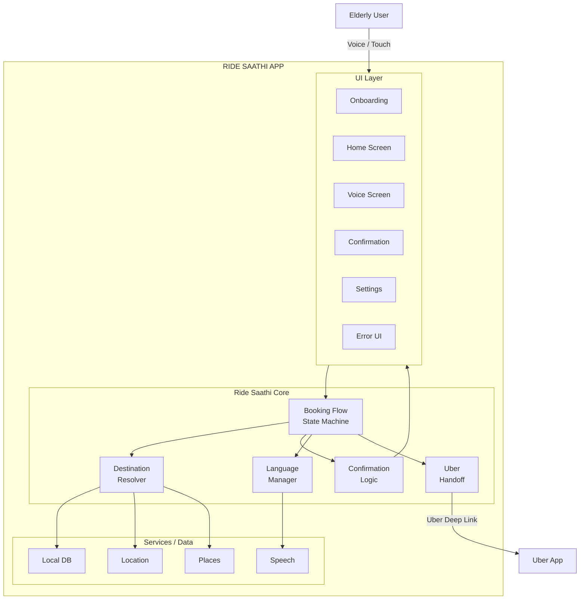
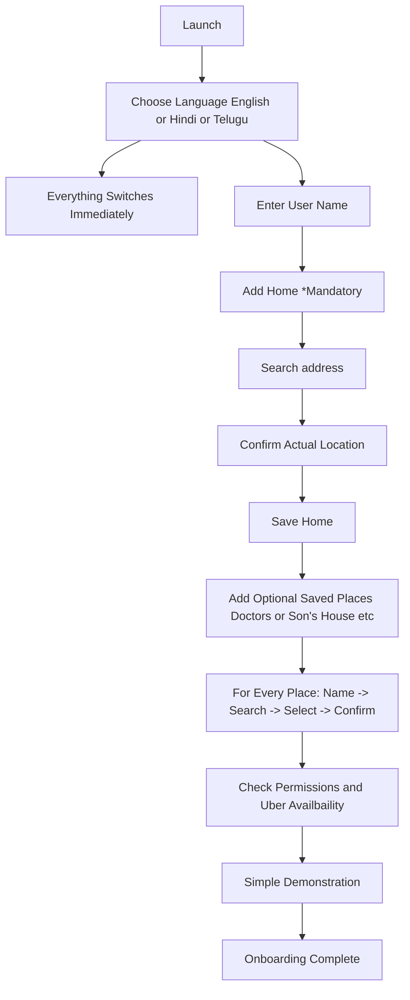
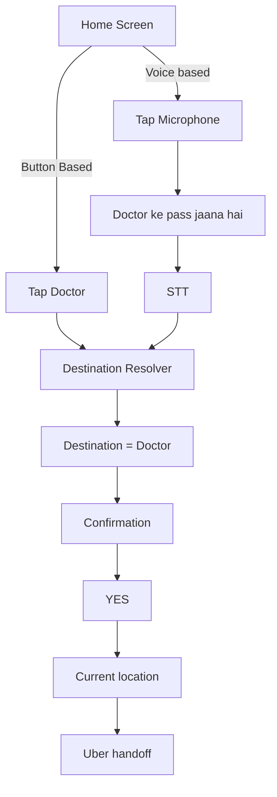
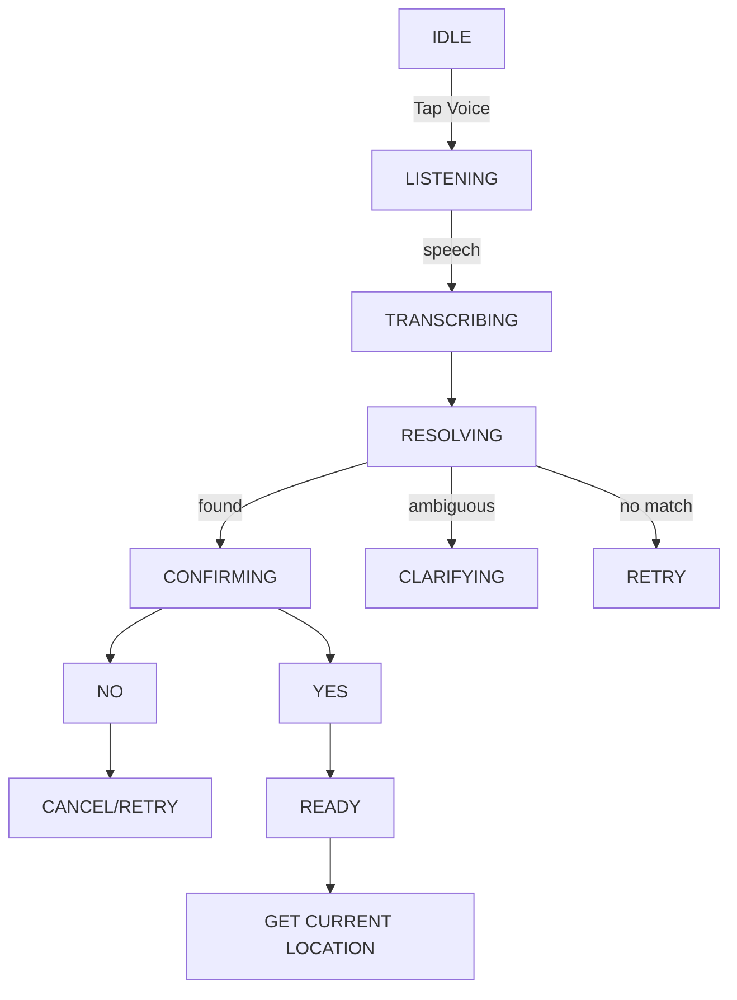

## Requirements

- Easy to book an Uber ride via voice conversations for the elderly people who are not that technically skilled to book an Uber ride from their mobile devices.
- Have a list of saved places inside the app done during the initial onboarding process of the app.
- The onboarding process can be initially setup by a family member once.
- User needs to enter the Home address and it is mandatory for all users to enter their home address.
- Multi-lingual Support (Englist/Hindi/Telugu for now)
- The entire app should work with the same language once the user has chosen it, even while onboarding.
- Extremely easy to use and friction less to use.
- Confirm the location to the user first before continuing to the cab-service app.
- In terms of booking, we are not exactly handling the booking of a cab or bike because the can booking apps do not provide their API's to book in behalf of them.
- Uber has the option of deeplinks (<https://developer.uber.com/docs/riders/ride-requests/tutorials/deep-links/introduction>) where we can create links with geo-location of pickup and dropoff which will help the Uber app to open the application with prefilled details about the location, then the user has to just choose the necessary ride he/she needs.
- Currently we will only develop this app for Uber in mind.

### Current Roadmap

- V0 will be completed when we do complete the necessary requirements up and then we will go further.
- We will test it out with few elderly people when, we have a proper voice-based approach and get their feedback.
- We launch online to my others when at least 3-5 elderly people can easily operate the app.
- **Note**: This is a side project, so we are just trying to solve a simple problem of making the elderly people around me to not annoy me anymore to book their rapido or uber and they themselves can manage it.

## Current Scope

### Ride Saathi V0 does

- Stores user profile
- Stores Home
- Stores saved destinations
- Lets user tap destination
- Lets user speak destination
- Understands Multi-lingual (English/Hindi/Telugu)
- Confirms destination
- Gets current pickup location
- Generates Uber handoff
- Opens Uber

### Ride Saathi V0 does NOT do

- Book an Uber itself
- Select Uber Cab/Auto/Bike
- Handle payment
- Show driver information
- Track the ride
- Cancel Uber rides
- Estimate fares
- Estimate arrival time
- Handle arbitrary destinations by voice
- Replace Uber

## System Architecture

## User Flows

### Onboarding Flow

### Booking Flow

## Data Models

### User

| Property             | Purpose               |
| -------------------- | --------------------- |
| Name                 | Personalized Prompts  |
| Language             | en, hi, te            |
| Onboarding Completed | Prevent partial setup |

### Saved Place

| Property          | Purpose                          |
| ----------------- | -------------------------------- |
| ID                | Internal Identity                |
| Friendly Name     | "Home", "Doctor", "Ramesh House" |
| Voice aliases     | "hospital", "doctor", "etc"      |
| Formatted address | Confirmation + Uber              |
| Latitude          | Navigation                       |
| Longitude         | Navigation                       |
| Is Home           | Special mandatory destination    |

## State Machines

### Voice

## Edge Cases

| Situation                                         | Ride Saathi should do                                                                                                                                                                                                                         |
| ------------------------------------------------- | --------------------------------------------------------------------------------------------------------------------------------------------------------------------------------------------------------------------------------------------- |
| Microphone permission denied                      | Explain simply + offer button flow                                                                                                                                                                                                            |
| Location permission denied                        | Explain why pickup location is needed                                                                                                                                                                                                         |
| GPS disabled                                      | Enable location from the app                                                                                                                                                                                                                  |
| Current location unavailable                      | Don't silently guess, ask the user to try opening their location permission                                                                                                                                                                   |
| Current location stale                            | Request/update location                                                                                                                                                                                                                       |
| Internet unavailable                              | Show simple retry + saved places remain available                                                                                                                                                                                             |
| Speech cannot be understood                       | Ask once again                                                                                                                                                                                                                                |
| Speech repeatedly fails                           | Fall back to large saved-place buttons                                                                                                                                                                                                        |
| No destination matches                            | Tell user and show saved destinations                                                                                                                                                                                                         |
| Two destinations match                            | Ask which one                                                                                                                                                                                                                                 |
| User says "no"                                    | Return to destination selection                                                                                                                                                                                                               |
| User changes mind                                 | Cancel flow                                                                                                                                                                                                                                   |
| User says "cancel"                                | Immediately stop voice flow                                                                                                                                                                                                                   |
| Uber not installed                                | Confirm before completing onboarding and also check before handing opening Uber and if not there  Tell the User to Download it by going to the playstore or provide them a button to open the play store directly so that they can install |
| Uber cannot handle destination                    | Keep user inside Uber and don't pretend booking succeeded                                                                                                                                                                                     |
| Place removed/renamed                             | Update saved destination                                                                                                                                                                                                                      |
| Home accidentally deleted                         | Require replacement before deletion                                                                                                                                                                                                           |
| Two saved places have same name                   | Prevent them while creation or updation itself by suggesting there is already a place with this name.                                                                                                                                         |
| STT detects wrong language                        | Stay with selected language unless user intentionally changes settings                                                                                                                                                                        |
| Voice starts while audio is playing               | Stop prompt before listening                                                                                                                                                                                                                  |
| User waits too long                               | Repeat once rather than remaining stuck                                                                                                                                                                                                       |
| Phone call interrupts app                         | Safely cancel/pause voice session                                                                                                                                                                                                             |
| App is killed midway                              | Never resume directly into Uber                                                                                                                                                                                                               |
| User double taps destination                      | Prevent duplicate navigation actions                                                                                                                                                                                                          |
| User taps YES repeatedly                          | Uber should only launch once                                                                                                                                                                                                                  |
| Device lacks Uber                                 | Web/store fallback and tell them to install it                                                                                                                                                                                                |
| Destination coordinates exist but address missing | Repair destination before handoff                                                                                                                                                                                                             |
| User says something unrelated                     | Explain available destinations                                                                                                                                                                                                                |
| User says a destination not saved                 | V0 says it isn't saved rather than guessing                                                                                                                                                                                                   |

# V0 development roadmap

1. **Freeze the product contract.**
2. **Build onboarding without voice.**
3. **Build button-only booking.**
4. **Build the booking state machine.**
5. **Build Uber handoff resilience.**
6. **Add speech-to-text as an input method only.**
7. **Build destination resolution.**
8. **Add conversational confirmation.**
9. **Build failure recovery.**
10. **Do accessibility polish only after the complete flow works.**
11. **Test internally with adversarial scenarios.**
12. **Then put it in front of the 3–5 elderly users you mentioned.**

## Android implementation

The V0 Android app is in `app/`. It uses Kotlin, Jetpack Compose, on-device preferences for the profile and saved places, OpenStreetMap address search and map preview for family setup, Android speech recognition and text-to-speech, and a native Uber ride-request link. It does not book or pay for a ride.

### Run it

1. Install Android Studio with JDK 21 and Android SDK 36. Open this directory as a Gradle project.
2. Build with `./gradlew assembleDebug` and install `app/build/outputs/apk/debug/app-debug.apk` on a physical Android phone with Google Play services, a speech recognition service, and Uber. No map API key or billing account is needed. The app needs internet for address search and map preview, location permission for pickup, and microphone permission for voice input.
3. Complete onboarding, search for and select Home, check its pin on the map, add any other destinations, and verify the Uber handoff. On Android, Uber may show the destination after the rider taps **Set Pickup Location**.

Address search uses the public Nominatim service only when Search is tapped. It does not autocomplete; results are cached in memory, and requests from one device are limited to one per second. The public service's limit applies to **all devices combined**, so use it only for a few prototype testers. The map preview uses OpenStreetMap's embedded map, which displays attribution and follows normal browser tile caching. Both HTTPS service URLs can be changed in Settings on each installed device without rebuilding the APK; replacement services must support the same search or embed URL parameters. Public services can refuse or become unavailable, so use appropriately provisioned services before a wider pilot. See the [Nominatim policy](https://operations.osmfoundation.org/policies/nominatim/) and [tile policy](https://operations.osmfoundation.org/policies/tiles/).

Saved places remain on the device. Clearing app data removes them. The prototype has no family account, cloud sync, fare information, ride type selection, or ride status. Before the elderly-user pilot, validate the three speech and spoken-output languages, screen reader behavior, map search, and the final Uber screen on the actual target phones.
