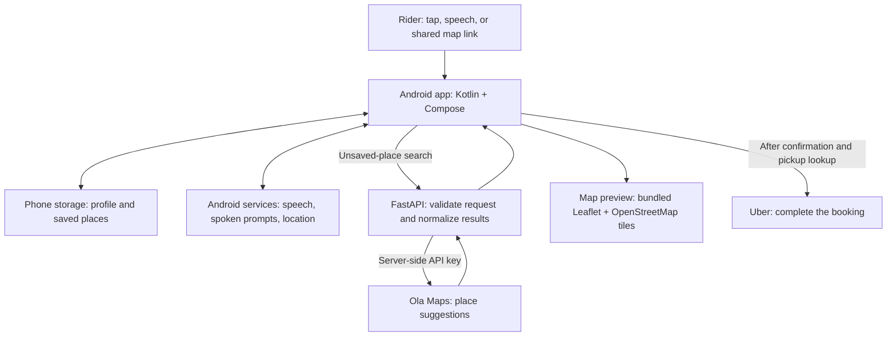
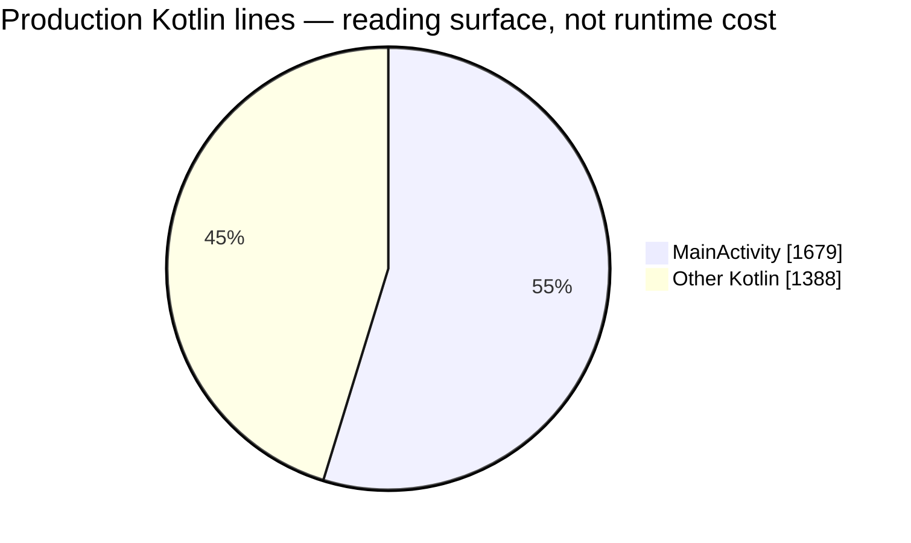

# Understanding Ride Saathi — lesson 1

Snapshot: 26 September 2026, source revision `c517fca`.

This is an initial architecture walkthrough and a small, evidence-based audit. It is not a complete correctness, security, accessibility, or performance certification. Application code was not changed. Findings below distinguish observed behavior from recommendations and unmeasured costs.

## 1. The product boundary

Ride Saathi helps a rider select a destination, confirm it, obtain a pickup location, and open Uber with those details. Uber owns vehicle selection, fares, payment, booking, tracking, and cancellation. Opening Uber is not proof that a ride was booked.



Map tiles are fetched from OpenStreetMap directly by the phone. They do not pass through FastAPI. Supported shared map links may also require direct redirect requests from the phone. Speech recognition is supplied by the device's recognition service; this repository does not establish that speech stays on the device.

The saved destination data lives locally as JSON strings in Android SharedPreferences. This backend has no user-account or ride database. Local persistence does not mean destinations never leave the phone: search queries/location go to the backend and its provider, map tiles identify the viewed region, and pickup/drop-off details are sent to Uber.

## 2. Android concepts using your FastAPI experience

| Concept in this repository | What it means | Useful backend analogy and its limit |
| --- | --- | --- |
| Kotlin | The language used for most phone-side code | Python is your backend language; Kotlin is the phone language here. |
| `MainActivity` | The Android-managed host for this app's UI and much of its coordination | An entry point/controller. Unlike an HTTP handler, it stays involved across many events and can be paused or recreated by Android. |
| Jetpack Compose | UI functions describe what to display for the current state | Similar to rendering a view from data, but observable changes can rerun UI functions automatically. |
| `@Composable` | Marks a function that participates in Compose UI rendering | A UI-specific annotation, not an HTTP route. |
| State | Values such as selected destination, current screen, and loading status | Like a workflow/session record held in memory. Changing observable state updates the screen. |
| `data class` | A Kotlin data container, such as `SavedPlace` | Similar to a Python dataclass. It does not automatically validate input like a configured Pydantic model. |
| `val`, `var`, and `?` | Read-only binding, mutable binding, and a nullable type | Think assignment rules and `Optional`; a `val` reference does not make every referenced object deeply immutable. |
| `interface` | A contract that different implementations can satisfy | Similar to a Python protocol; `PlaceSearchProvider` helps substitute fake search results in tests. |
| SharedPreferences | Small persistent key/value storage on the phone | A local settings store, not a relational database. |
| Intent | A message asking Android to perform an action | Closer to dispatching an external action than calling your own service. The Uber intent asks another installed app to open. |
| Lifecycle | Android calls `onCreate`, `onPause`, `onStop`, and `onDestroy` as the activity changes status | There is no exact HTTP equivalent. Background work must account for its UI owner disappearing. |
| Gradle / APK | Build system / installable Android package | Roughly build tooling / deployable artifact. `AndroidManifest.xml` declares permissions and entry points. |

The basic UI cycle is: **event → update state → render the relevant UI**. For example, selecting a destination changes `selected` and sets `screen` to `"confirm"`; Compose then displays the confirmation UI. A screen is not a separate Activity here: `App()` switches between functions using the screen string.

There are two different kinds of state: saved profile/places survive reopening; active selection, search and editor values mostly live in the Activity instance. `onCreate()` loads saved data and chooses Home or onboarding. It does not restore an in-progress editor/search workflow. Restarting a pending ride can be an intentional safety choice; losing an address draft is a separate UX question. The existing rotation test explicitly expects that a pending ride does not resume.

## 3. Read one journey before reading every file

Start with tapping a saved destination. It avoids the extra speech and search branches.

```mermaid
sequenceDiagram
    participant Rider
    participant UI as Compose UI
    participant Activity as MainActivity
    participant GPS as Android location service
    participant Uber
    Rider->>UI: Tap saved Home
    UI->>Activity: choose(place)
    Activity->>UI: selected = Home; screen = confirm
    Note over UI,Activity: Show address/map and speak confirmation
    Rider->>Activity: Tap microphone and say Yes
    Activity->>Activity: Reject duplicate handoff; check Uber installed
    Activity->>GPS: Request permission if needed, then fresh pickup
    GPS-->>Activity: Location or failure
    alt Valid result for the still-active request
        Activity->>Uber: Intent with pickup and drop-off
        Note over Rider,Uber: Rider must complete booking in Uber
    else Missing/unacceptable location or request cancelled
        Activity->>UI: Report failure or ignore obsolete callback
    end
```

Read these functions in order in `android/app/src/main/java/com/ridesaathi/app/`:

1. `MainActivity.kt:831` — `PlaceRow`: the saved-destination button calls `choose`.
2. `MainActivity.kt:1427` — `choose`: cancel previous activity, store the selection, show confirmation, speak the address.
3. `MainActivity.kt:1063` — `Confirmation`: address, map, and recovery UI. The surrounding `App()` adds the microphone; currently there is no touch-to-confirm action.
4. `MainActivity.kt:1563` — `confirmRide`: guard against repeated handoff and check installation/permission.
5. `MainActivity.kt:1591` — `fetchLocation`: obtain fresh pickup and reject a stale callback before opening Uber.
6. `Domain.kt:90` — `UberHandoff`: encode coordinates and destination into an Android intent.

Search location and pickup location are different operations. Search accepts a location up to 120 seconds old and reported accuracy up to 5 km, with an 8-second lookup deadline. Pickup requests a fresh high-accuracy location with a 15-second duration; it rejects reported accuracy worse than 250 metres. These are configured rules, not measured waiting times or guarantees of GPS accuracy. The pickup path accepts missing accuracy metadata; whether that should be stricter needs review.

Voice adds a branch before selection: Android returns a transcript → `handleSpeech` → `DestinationResolver.matches`. One saved match leads to confirmation; multiple matches ask for clarification; zero matches start online destination search. Matching is local, rule-based text processing, not an LLM. Search results are shown three at a time and require selection and confirmation.

## 4. Measured size and test baseline

Counts use physical lines from `splitlines()`, including blank lines and comments. Production Kotlin means files under `android/app/src/main/java`; backend Python means files under `backend/app`. Tests, generated build output, vendored Leaflet, resources and Gradle configuration are excluded from these production counts. Line count measures reading surface, not runtime cost or quality.

| Measurement | Value | Meaning |
| --- | ---: | --- |
| Production Kotlin | 12 files, 3,067 lines | Most application behavior lives on the phone. |
| `MainActivity.kt` | 1,679 lines; 54.7% of Kotlin | More than half of the Kotlin reading surface is concentrated here. |
| Other Kotlin | 1,388 lines | Models, matching, search, shared links, map, wording and theme. |
| Backend Python | 9 files, 302 lines | Includes empty package marker files. |
| Observable Activity fields | 26 | Count of Activity-level `private var ... mutableStateOf` declarations; excludes local UI state and other mutable fields. |
| JVM test declarations | 52 across 7 files | Declaration count; execution status is recorded separately below. |
| Device test declarations | 50 across 6 files | Device test runner is included in the file count; these tests were not run in this audit. |



Verification on this snapshot:

- Backend: **36 passed**, two dependency deprecation warnings. Command: `cd backend && .venv/bin/python -m pytest -q -p no:cacheprovider`. Upstream calls use mocks.
- Map JavaScript: **4 passed** using `node android/app/src/test/js/map-preview.test.cjs`. The `node --test` invocation also exited successfully but reported a file-level count of one in this environment; four is the direct runner's named-case count.
- Android JVM: **52 passed**, zero failures/errors across seven XML test reports. Command: `./android/gradlew -p android :app:testDebugUnitTest --offline`. Gradle reported a deprecated Kotlin build setting and an SDK metadata-version warning; the task completed successfully. The initial restricted run could not write the Gradle cache; the rerun with cache access passed. The initial sandboxed backend run stalled and was stopped; the bounded rerun outside that restriction passed.
- No connected Android tests, live microphone/TTS/GPS, real provider searches, or actual Uber handoff were exercised in this audit. Prior results in `VALIDATION.md` are historical and cover different revisions.
- No code-coverage percentage, startup benchmark, battery profile, network latency percentile, or live booking-success rate was measured. Test counts do not supply those numbers.

## 5. What already deserves to be preserved

- Destination matching rejects substrings such as Home inside homework, prefers more-specific contained names, and preserves genuine ambiguity for the rider.
- Negative confirmation takes precedence over Yes in conflicting recognized phrases.
- Selecting a place and confirming the handoff are separate actions.
- Generations/cancellation checks discard obsolete speech, search and location results. Think of the generation as a request version: if the user cancels request 4, its eventual response cannot overwrite request 5.
- Search I/O runs on worker threads, with UI updates posted back to the main thread. Slow I/O is not deliberately performed inside the drawing functions.
- Backend input validation and normalized provider errors keep much of the upstream implementation out of the phone contract.
- The upstream API key stays out of Android build configuration. Logging still needs correction as described below.

These are meaningful design decisions. Do not delete them as “extra complexity” while splitting files.

## 6. Initial findings and proposed improvements

### A. Confirmed logging exposure — address before wider deployment

Evidence: `backend/app/main.py:12` sets root logging to INFO. `backend/app/services/ola_maps.py` places the key, search query and location in query parameters and uses HTTPX. A diagnostic in a fresh Python process imported the actual app and called the actual service with a mocked transport, a fake key and a fake address. The HTTPX INFO record contained all three. No real credential or user address was used and no network request was sent.

The hand-written request middleware omits sensitive fields, but dependency logging defeats that policy. HTTPX documents its INFO request-URL logging: https://www.python-httpx.org/logging/ . Existing tests verify response-body secrecy; they do not capture all emitted logs. Therefore 36 passing tests do not disprove this finding.

Proposed next change: configure dependency logging/redaction explicitly and add a log-capture regression check for fake credentials, query and coordinates. Review server/proxy access logging as well, because the phone sends search fields in a GET query. Deployed logging was not inspected. If real secrets have been logged, review access and rotate affected credentials after stopping the exposure.

Acceptance: successful and failed mocked searches emit useful operational fields with no fake sensitive values in captured logs; deployment logging behavior is checked separately.

### B. Confirmed documentation drift — resolve the product rule

Current code requires a recent valid device location for online search and enforces a 50 km straight-line radius. `SearchBoundary.kt` implements the radius; `PlaceProviders.kt` enforces it; destination/editor/shared-address paths also filter results. Device test source includes `unavailableLocationNeverFallsBackToHomeOrCallsProvider` and `currentLocationSetsBoundaryEvenWhenSavedHomeIsInAnotherCity`.

`PILOT_TESTING.md` still describes a Home fallback and searching another city without that restriction. Those instructions disagree with the implementation. This is a documentation defect; the intended geographic scope is a product decision, so the radius itself is not labelled a bug here. Direct shared coordinates and saved places take other paths and should not be described as universally radius-limited.

Proposed next change: agree whether search is nearby-only, then align the checklist and help text with that decision. Preserve historical validation as historical rather than rewriting it to imply new tests passed.

Acceptance: code, product explanation and pilot expectations agree on unavailable GPS, distant destinations and saved Home in another city.

### B2. Confirmation requires speech — functional gap before broader testing

`Confirmation()` renders destination details, map and recovery actions. `App()` adds a microphone control. Searching every production call site of `confirmRide()` finds only the `VoiceDecision.Yes` branch in `handleSpeech` at `MainActivity.kt:1541`. There is no touch-to-confirm action, despite unused Yes/No labels in `Words.kt` and historical touch-confirmation claims in documentation.

Consequently, a rider can select a saved place by touch but cannot reach Uber through the current UI if microphone permission is denied or speech recognition is unavailable. This is a source-confirmed missing path; it has not been reproduced on a physical phone in this audit. The current device test named `englishTouchSelectionAllowsVoiceCancellation` covers touch selection followed by injected speech cancellation, not touch confirmation.

Proposed next change: provide explicit accessible confirmation and choose-again actions alongside speech, preserving the same guards and pickup checks. Acceptance: a microphone-denied rider can select, review, confirm and reach a mocked Uber handoff entirely by touch; negative confirmation never opens Uber. Verify on a target phone as well.

### C. Concentrated coordination — the main source of cognitive debt

`MainActivity` owns UI rendering, navigation, saved-place editing, speech, TTS, three search/shared-input flows, permission handling, pickup and Uber dispatch. It also has 26 observable member fields plus cancellation/thread bookkeeping. Reading one behavior requires understanding several neighbors. String screen names and separately mutable fields allow combinations that must be kept consistent manually.

Proposed direction: extract one workflow at a time into explicit state and actions; move rendering into focused UI functions that receive values and callbacks. Consider a screen-level ViewModel for workflow state, keeping tiny visual state close to its UI and device resources managed by the appropriate lifecycle owner. This follows Android's state ownership guidance: https://developer.android.com/develop/ui/compose/state-hoisting . A ViewModel is not persistence after process death; restoration needs a separate design. Do not automatically resume a pending Uber handoff.

Acceptance: the saved-place → confirm → cancel/handoff flow can be explained and exercised without unrelated editor/search state; interruption safeguards and existing behavior remain intact. Splitting a file without clarifying state ownership is insufficient.

### D. Local data recovery — confirmed behavior, unmeasured frequency

`Domain.kt:41` catches any exception while parsing the entire saved-place list and returns an empty list. One malformed entry can make all saved destinations disappear from the UI, even if the other entries are usable. The failed read does not itself delete the stored JSON, but later writes could replace it. No corruption incident was observed.

Proposed next change: define a versioned storage contract, validate entries, retain recoverable data, and explain recovery to the user. Keep this small store unless actual requirements justify a database migration.

Acceptance: malformed-entry fixtures preserve valid places and do not silently present a corrupted profile as a brand-new installation.

### E. Efficiency candidates — measure before removing

| Observation | Possible cost | Proposed investigation |
| --- | --- | --- |
| Backend creates and closes an HTTPX client for each search | Loses connection reuse between requests | Compare reused-client behavior and latency under representative mocked/local load before changing lifecycle ownership. |
| Map preview polls JavaScript every 300 ms while mounted, including after Ready | Roughly 3.3 checks/second plus UI/runtime work; battery cost unknown | Determine whether event-driven status or narrower polling preserves later tile-error detection. |
| Home microphone animation repeats even while idle | Continuous rendering activity while displayed | Measure on target low-end phones; decide if the visual cue earns its cost. |
| The default provider filters by radius, then callers filter again | Duplicate distance calculations | Clarify which boundary guarantees callers need, including injected test providers, before consolidating. |
| Three Activity flows implement similar search/thread/cancellation steps | Repeated reasoning and maintenance work | Extract the shared operation while preserving distinct screen behavior. |

These observations do not establish that the app is slow. Worker-thread interruption also does not by itself prove that blocking HTTP I/O ends immediately; callback invalidation protects UI state, while transport cancellation/resource use needs separate verification.

The backend source has no authentication or rate limiter, and its README explicitly says so. Before a public endpoint is exposed widely, verify deployment-level quota/budget/abuse controls. External gateway protections were not inspected; there is no claim that a deployed system lacks them.

## 7. Learning and improvement order

1. **This lesson: system boundaries and the saved-place journey.** Be able to name where data lives, what triggers the backend, and where booking actually occurs.
2. **State and lifecycle.** Walk through `choose`, `cancelRide`, the generation checks and a rotation/background event. Document allowed states and transitions before proposing a state-holder extraction.
3. **Voice interpretation.** Follow a transcript through normalization, matching, ambiguity and confirmation. Use existing examples such as ghar versus beta ka ghar; separate recognition accuracy from matching correctness.
4. **Search and external dependencies.** Trace permissions → location → backend → provider → results. Resolve the radius rule and logging issue before treating old pilot instructions as authoritative.
5. **Storage and recovery.** Explain the JSON format, save/read paths, compatibility and corrupted-data behavior.
6. **Incremental cleanup.** For each proposed change, record current behavior, reason for the change, behavior to preserve, and focused verification. Implement only after the explanation phase is explicitly moved into editing.

Useful future measurements: incorrect-destination selection rate; assisted versus unassisted completion to the Uber screen; search and pickup p50/p95 latency separately; retries/timeouts; crashes; and time to understand/change a workflow. Define the denominator and observe real sessions before assigning targets. Avoid collecting raw transcripts or exact addresses just to populate these metrics.

Checkpoint: explain what happens after tapping Home, why a late GPS response must sometimes be ignored, and why successfully opening Uber is different from successfully booking. Those three answers establish the foundation for the next lesson.
